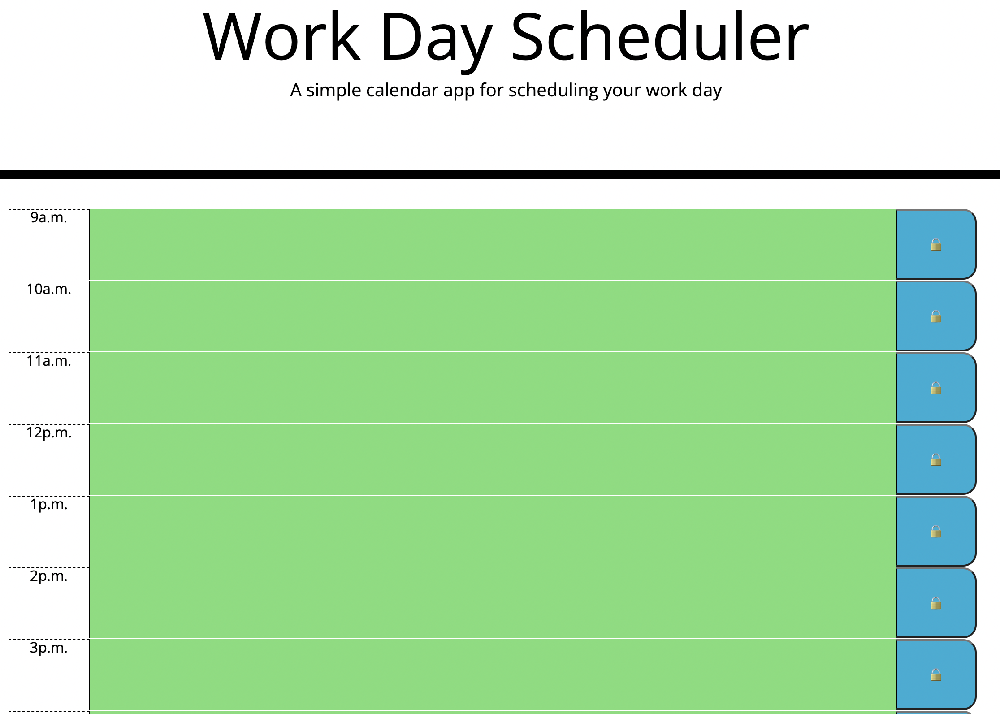

# Day-Planner

## Table of Contents 📖

* [ Description ](#description-📝)
* [ Application Preview ](#application-preview-⭐)
* [ Installation ](#installation-🛠️)
* [ Usage ](#usage-💡)
* [ Technologies ](#technologies-🔧)
* [ Notable Features ](#notable-features-⚡️)
* [ Contributor ](#contributor-🙌)
* [ License ](#license-🔑)

## Description 📝

This application is a day scheduler populated with the times of a normal 9:00am to 5:00pm work day. The user will be able to input text based on what they have going on in that particular hour block in their work day. If the page is accessed before 9:00am the blocks will be green. Present hours will be red and past hours will be grey. 

## Application Preview ⭐

## Installation 🛠️

To have access to this application from the deployed link, click [here](https://mayaimorales.github.io/day-planner/).

To have access to the application through the local machine, access the code repo, fork it, and clone the repo using the `git clone` command.

## Usage 💡

Click on the desired text area for the corresponding hour. Type text and click the lock button to save.

## Technologies 🔧

* HTML
* CSS
* JavaScript
* jQuery
* Bootstrap
* Moment.js

## Notable Features ⚡️

* Utilization of jQuery and Moment.js 

## Contributor 🙌

**Maya Morales** - [LinkedIn](https://www.linkedin.com/in/maya-morales-1191351bb/) - [GitHub](https://github.com/mayaimorales) - [Email](mayainomorales@gmail.com)

I am an aspiring full-stack developer. Please feel free to contact me with any questions, critiques, or other inquiries.

## License 🔑

